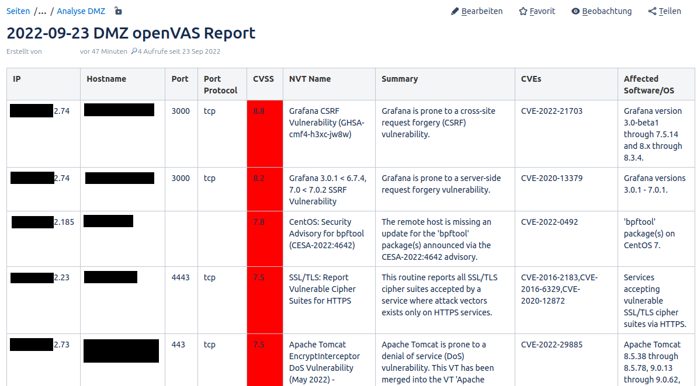

# Openvas Confluence Reporting

## About 
This script parses collected logs from finished openVAS tasks and sends them automatically to your confluence instance to display critical vulnerabilities in a table.
For each openVAS task, a parent page is needed. For each result of the task, a sub page will be created. Processed reports will be moved into the `archive` directory.

## Set up

1. Create an access token for confluence (Your Profile -> Settings -> Personal Access Token) 
2. Create the page hierarchy in confluence: For each task in openVAS, create a page in confluence. 
    - Retrieve the `KEY_SPACE` from the URL of that page (i.e. `confluence.domain.com/confluence/display/KEY/Pagetitle`) 
    - Retrieve the page ID, which you can get by visiting the detailed page information site (3 dots -> page info -> `page_id` in the URL).
3. Fill in the values at the top of `reporting.py`
```py
REPORTS_PATH = "/absolute/path/to/the/folder/reports/"  # Absolute path to the reports folder in this repository
ACCESS_TOKEN = "<TOKEN FROM STEP 1>"
KEY_SPACE = ""  # Key Space from step 2
PAGE_IDS = {"Task Name": "page_id"}     # Mapping of the openVAS Taskname to the confluence page_id from step 2. The Task name has to be the same as in openVAS .
API_URL = "https://confluence.domain.com/confluence/rest/api/content/" # Your instance API URL
```
4. Configure a notification for your openVAS Tasks with the following parameters:
    - State changed to `Done`
    - Severity at-least 7.0 
    - Delta-Report: None
    - Method: SCP. Configure ssh credentials to the server this script runs on and make sure to use the upload path of the `REPORTS`dir from above.
    - Report: CSV Results. Make sure that you are able to download CSV reports in general.
    - Make sure that the SCP upload works by setting it up for a task and let it finish.
5. Assign the notification to your tasks.
6. Set up a cronjob for the script to run, i.e. at a daily interval.

## Example

